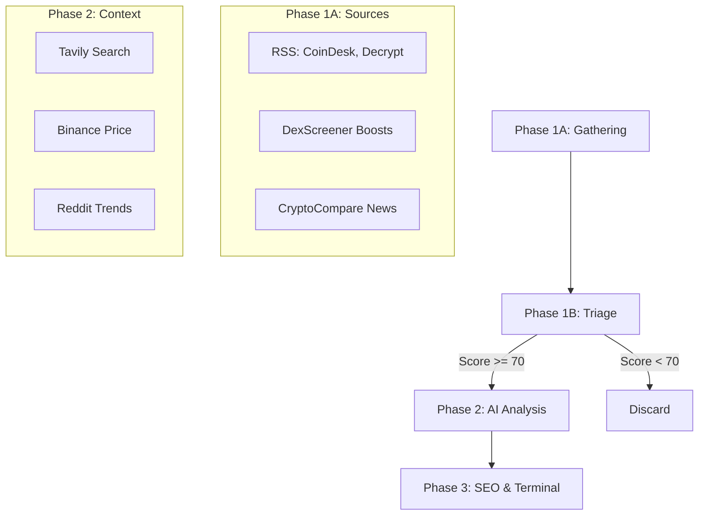

# 📁 OnlyAlpha: دليل الخدمات والـ Flow الجديد (2026)

يحتوي هذا الملف على التفاصيل الكاملة لمسار البيانات (Data Flow) والخدمات المرتبطة به لضمان أفضل تحليلات AI بأقل تكلفة ممكنة.

---

## 🔄 مسار البيانات الجديد (The New Flow)

---

## 🛠️ تفاصيل الخدمات (Pricing & Access)

### 1️⃣ مصادر الأخبار والبيانات اللحظية

| الخدمة | الغرض | التكلفة | API Key | ملاحظات |
| :--- | :--- | :--- | :--- | :--- |
| **RSS Scraper** | جلب الأخبار من المصادر العامة. | مجاني تماماً | لا | يعتمد على روابط الـ RSS المفتوحة. |
| **DexScreener** | رصد العملات اللي عليها Hype. | مجاني تماماً | لا | متاح عبر مسار `/token-boosts` العام. |
| **CryptoCompare** | أخبار مجمعة وبيانات تاريخية. | 100k طلب/شهر | نعم (لديك) | كريمة جداً وتعتبر "أمان" إضافي للأخبار. |
| **Binance Price** | جلب السعر اللحظي للعملة. | مجاني تماماً | لا | لا تحتاج لمفتاح للبيانات العامة (Public Tickers). |

### 2️⃣ الذكاء الاصطناعي (AI Engines)

| الخدمة | الغرض | التكلفة | API Key | ملاحظات |
| :--- | :--- | :--- | :--- | :--- |
| **GPT-nano (4o-mini)**| الفرز الأولي (Triage) والـ SEO. | زهيدة (Usage) | نعم (لديك) | تكلفة الـ 1M Token حوالي 0.15$ فقط. |
| **DeepSeek R1** | كتابة المقالات والتحليل العميق. | زهيدة (Usage) | نعم (لديك) | أقوى موديل حالياً وبسعر منافس جداً. |
| **Tavily AI** | بحث الـ AI لجلب سياق حديث. | 1k بحث/شهر | نعم (لديك) | أساسية لجعل المقالة "حية" ومسنودة بالأدلة. |

### 3️⃣ السياق الاجتماعي والبنية التحتية

| الخدمة | الغرض | التكلفة | API Key | ملاحظات |
| :--- | :--- | :--- | :--- | :--- |
| **Reddit API** | جلب مواضيع الـ Trends الحالية. | مجاني (بشروط) | نعم (OAuth) | لا تسمح بالمشاريع الجديدة بسهولة (صعبة حالياً). |
| **Redis Cache** | سرعة البرق في تحديث الواجهة. | مجاني تماماً | لا | يعمل محلياً (Self-hosted). |
| **CoinCap** | أسعار واحصائيات إضافية. | 4k نقطة/شهر | نعم (لديك) | **محدودة جداً**؛ يُفضل الاعتماد على Binance و CryptoCompare. |

---

## 💡 توصيات التنفيذ (Recommendations)

1.  **قتل CoinCap تدريجياً:** استبدلها بـ Binance للأسعار اللحظية لأن Binance مجانية تماماً ولا تستهلك نقاطك المحدودة (4000 فقط).
2.  **التركيز على Tavily:** في الـ AI Analysis، اجعل الموديل يطلب بحث Tavily دائماً ليتأكد من صحة الخبر، هذا هو ما سيميز OnlyAlpha عن "News Bots" العادية.
3.  **تجنب Reddit المباشر حالياً:** بما أن Reddit أصبحت تمنع المطورين الجدد، يمكنك استخدام Tavily للبحث في Reddit بدلاً من الـ API الرسمي لـ Reddit (كخطة بديلة "Workaround").
4.  **دمج CryptoCompare مع RSS:** استخدم CryptoCompare كمدخل أساسي للأخبار المنسقة، والـ RSS كمدخل للأخبار العاجلة والسبق الصحفي.

---
*تم إنشاء هذا المستند بتاريخ 3 أبريل 2026 لمشروع OnlyAlpha.*
