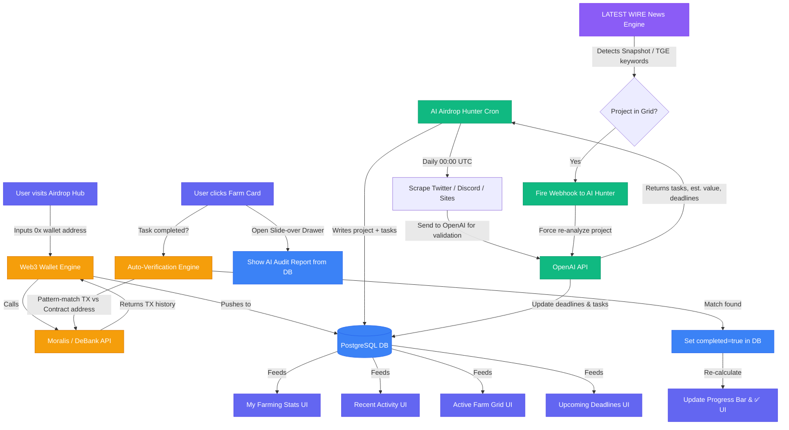

# 🪂 Airdrop Tracker Hub — Master Engineering Architecture

## 📌 1. Overview
The **Airdrop Tracker Hub** is not a simple manual to-do list. It is a **Web3-powered DApp** backed by Artificial Intelligence. Its mission is to transform the chaotic, time-consuming process of hunting and farming airdrops into a single, automated, intelligent tracking system that:
- **Connects** to the user's blockchain wallet (read-only).
- **Analyzes** their on-chain transaction history automatically.
- **Discovers** legitimate new airdrop opportunities using AI.
- **Verifies** completed tasks autonomously by cross-referencing smart contract interactions.

## 🔗 2. Sub-Feature Documentation
This Master Guide references three detailed sub-system documents:
- [⚙️ Web3 Wallet Engine (My Farming Stats & Recent Activity)](./Web3-Wallet-Engine.md)
- [🤖 AI Airdrop Hunter (Active Farm Grid & Upcoming Deadlines)](./AI-Airdrop-Hunter.md)
- [🎯 Smart Interactive UI & Auto-Verification (Progress Bar & Drawer)](./Smart%20Interactive-UI&Verification.md)

---

## 🏗️ 3. UI Components → Backend Logic Mapping
Each UI section in `airdrop.html` is powered by a specific backend engine:

| UI Section (from Design) | Powered By | Data Source |
|---|---|---|
| **Top Ticker Bar** (BTC, ETH, SOL prices) | Server-Sent Events (SSE) | Binance WebSocket |
| **Active Farm Grid** (ZkSync, LayerZero cards) | AI Airdrop Hunter | OpenAI + Web Scrapers |
| **Task Checklist** (✅ checkmarks per project) | Auto-Verification Engine | Moralis API + DB |
| **Farming Progress Bar** (75%, 88%...) | Auto-Verification Engine | Calculated from DB |
| **My Farming Stats** ($4,500+, 1,242 TXs) | Web3 Wallet Engine | DeBank / Moralis API |
| **Recent Activity** ("Swapped 0.2 ETH on ZkSync") | Web3 Wallet Engine | Moralis Transaction History |
| **Upcoming Deadlines** (countdown timers) | AI Airdrop Hunter (Event-Driven) | AI-parsed + DB |

---

## ⚙️ 4. Core Feature Logic

### 4.1 Web3 Wallet Engine
* **Authentication Model:** Read-Only Tracking. User provides their public wallet address (`0x...`). No MetaMask signing required for the MVP, enabling frictionless onboarding.
* **Tracking:** The backend queries Moralis / DeBank APIs to pull the full transaction history across supported chains (Ethereum, ZkSync, Linea, Berachain, etc.).
* **Stats Computation:** Aggregates data to compute `Total TXs`, `Wallets Active`, and estimated `Unrealized Value`.
* **Activity Feed:** Raw transaction data is parsed and translated into human-readable English sentences (e.g., *"Swapped 0.2 ETH on ZkSync — 2 minutes ago"*).

> **Full details:** [Web3-Wallet-Engine.md](./Web3-Wallet-Engine.md)

### 4.2 AI Airdrop Hunter
* **Anti-Scam Validation:** All scraped project data is sent to OpenAI with a prompt that validates legitimacy before the project ever appears in a user's Grid.
* **AI Output per Project:** Generates the task checklist, estimated airdrop value (`Est. Value`), and extracts critical deadlines (Snapshot, TGE).
* **Manual Override:** For social tasks impossible to auto-verify (e.g., joining Discord), users can manually tick the checkbox.

> **Full details:** [AI-Airdrop-Hunter.md](./AI-Airdrop-Hunter.md)

### 4.3 Smart Interactive UI & Auto-Verification
* **Slide-over Drawer:** Clicking any Farm Card opens a right-side drawer with the full AI-generated project audit report (tokenomics, eligibility criteria, risk verdict).
* **Auto-Verification:** The system pattern-matches the AI-extracted task conditions (e.g., `Bridge ≥ 0.5 ETH to ZkSync Bridge Contract`) against the user's real on-chain transactions from Moralis.
* **Progress Bar Update:** A confirmed match triggers a `completed: true` flag in the DB, instantly updating the Progress Bar and ✅ checkmark in the UI.

> **Full details:** [Smart Interactive-UI&Verification.md](./Smart%20Interactive-UI%26Verification.md)

---

## ⏱️ 5. Hybrid Cron Architecture
A dual-timing strategy is used to balance AI cost efficiency with real-time responsiveness:

| Job | Frequency | Trigger Type | Function |
|---|---|---|---|
| **New Airdrop Discovery** | Every 24h (UTC 00:00) | Scheduled | Deep scan for brand-new airdrop projects |
| **Routine Sync** | Every 12h | Scheduled | Check active projects for new tasks or date changes |
| **Emergency Update** | Immediate | Event-Driven (from LATEST WIRE) | Fires when news engine detects `Snapshot`, `TGE`, or `Claim` keywords for a tracked project |

> The **Event-Driven Trigger** is the key integration point between the **LATEST WIRE** news engine ([Terminal docs](../termnal/the-posts.md)) and the **Airdrop Tracker**. When breaking news is detected, a webhook purges and recomputes the relevant project's deadlines within 5 minutes.

---

## 🗄️ 6. Database Schema (PostgreSQL / Drizzle ORM)

```typescript
// Airdrop Projects discovered and validated by AI
export const airdropProjects = pgTable('airdrop_projects', {
  id: serial('id').primaryKey(),
  name: varchar('name', { length: 100 }).notNull(),           // e.g., 'ZkSync Era'
  network: varchar('network', { length: 50 }).notNull(),       // e.g., 'Mainnet', 'Testnet'
  estValue: varchar('est_value', { length: 30 }),              // e.g., '$1,200'
  aiReport: text('ai_report'),                                 // Full AI audit report (for Drawer)
  snapshotAt: timestamp('snapshot_at'),                        // Deadline for snapshot
  tgeAt: timestamp('tge_at'),                                  // Token Generation Event date
  createdAt: timestamp('created_at').defaultNow().notNull(),
});

// Tasks per project, extracted by AI
export const airdropTasks = pgTable('airdrop_tasks', {
  id: serial('id').primaryKey(),
  projectId: integer('project_id').references(() => airdropProjects.id).notNull(),
  description: text('description').notNull(),                  // e.g., 'Bridge 0.5 ETH to Mainnet'
  contractAddress: varchar('contract_address', { length: 100 }), // For auto-verification
  isAutoVerifiable: boolean('is_auto_verifiable').default(false),
});

// Users identified by their Web3 wallet address
export const users = pgTable('users', {
  id: serial('id').primaryKey(),
  walletAddress: varchar('wallet_address', { length: 100 }).notNull().unique(),
  createdAt: timestamp('created_at').defaultNow().notNull(),
});

// Junction table: tracks which tasks each user has completed
export const userProgress = pgTable('user_progress', {
  id: serial('id').primaryKey(),
  userId: integer('user_id').references(() => users.id).notNull(),
  taskId: integer('task_id').references(() => airdropTasks.id).notNull(),
  completedAt: timestamp('completed_at').defaultNow().notNull(),
  verifiedBy: varchar('verified_by', { length: 20 }).default('auto'), // 'auto' | 'manual'
});
```

---

## 🔀 7. Full Data Flow Diagram



---

> 💡 **The Bottom Line:**
> The Airdrop Tracker operates as a three-engine system running in parallel:
> 1. 🦊 **Wallet Engine** tracks *what the user has already done* on-chain.
> 2. 🤖 **AI Hunter** discovers and updates *what projects exist and what tasks they require*.
> 3. 🎯 **Verification Engine** bridges the two — automatically crossing off completed tasks by comparing (1) with (2).
