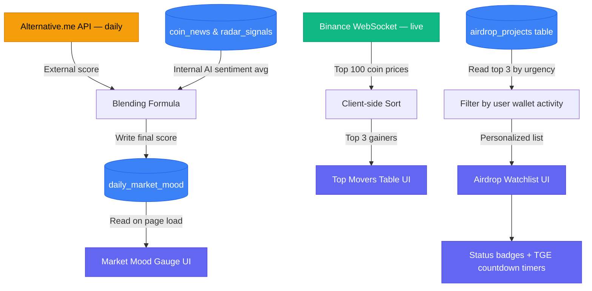

# 📊 Feature: Global Market Widgets (Right Sidebar)

## 📌 1. Overview
The **Global Market Widgets** are the three stacked panels that form the right sidebar of the Home page. Each widget has a distinct, independent data source and update frequency:

| Widget | Data Source | Update Cycle |
|--------|-------------|-------------|
| **Market Mood** (Fear & Greed) | Hybrid: External API + Internal AI | Daily |
| **Top Movers** | Binance API (Direct) | Real-time (WebSocket) |
| **Airdrop Watchlist** | Internal `airdrop_projects` DB table | On-change (Event-Driven) |

---

## 😨 2. Widget 1: Market Mood (Fear & Greed Gauge)

### UI Elements (from `home.html`)
- **Gauge Meter** → Half-circle arc, green fill at 75%
- **Score** → Large `75` numeral in the center
- **Label** → `GREED` (dynamic: Fear / Neutral / Greed / Extreme Greed)
- **Axis Labels** → `FEAR` on left, `GREED` on right

### The Architecture Decision: Hybrid Model ✅

The answer to your question is **neither one alone — a Hybrid is the best approach**.

Here's the reasoning:

**Option A: Alternative.me API alone (External only)**
- ✅ Zero computation cost
- ❌ It only measures Bitcoin sentiment. Not $SOL, $LINK, or the assets our platform focuses on.
- ❌ Exposes us to a **third-party failure point** — if their API is down, our gauge breaks.
- ❌ Gives us no differentiation vs any other platform showing the same number.

**Option B: AI-Computed (Internal only)**
- ✅ Based on OUR news analysis data — directly reflects what our platform is seeing
- ✅ Creates a **proprietary score** unique to OnlyAlpha
- ❌ Requires meaningful volume of daily analyzed news to be statistically valid

**Option C: Hybrid (The chosen approach)**
1. **Primary Source:** Alternative.me API provides the "global macro" baseline score.
2. **Correction Layer:** Our internal `radar_signals` and `coin_news` tables from today's analysis compute an **OnlyAlpha Sentiment Delta** (`+/- adjustment`).
3. **Final Score:** `Final Score = (Alternative.me Score × 0.6) + (Internal AI Score × 0.4)`

This gives us a score that is:
- **Grounded** in the industry-standard macro index
- **Enhanced** by our own proprietary sentiment analysis
- **Resilient** because if our internal AI has insufficient data, the weight shifts fully to the external API (fallback logic)

### Data Flow
```
Alternative.me API (daily) ──────────────┐
                                          ├──► Blending Formula ──► daily_market_mood table ──► Gauge UI
Internal AI Sentiment (from coin_news) ──┘
```

### Database Schema
```typescript
export const dailyMarketMood = pgTable('daily_market_mood', {
  id: serial('id').primaryKey(),
  moodDate: date('mood_date').notNull().unique(),
  externalScore: integer('external_score').notNull(),     // From Alternative.me (0-100)
  internalScore: integer('internal_score'),               // From our AI sentiment (0-100)
  finalScore: integer('final_score').notNull(),           // Blended composite
  label: varchar('label', { length: 30 }).notNull(),      // 'Extreme Fear' | 'Fear' | 'Neutral' | 'Greed' | 'Extreme Greed'
  calculatedAt: timestamp('calculated_at').defaultNow(),
});
```

---

## 🚀 3. Widget 2: Top Movers (24h Leaderboard)

### UI Elements (from `home.html`)
- **Table** → 3 columns: Asset name, Price, Change %
- **Entries** → PENDLE `+18.4%`, JUP `+12.2%`, ONDO `+9.8%`
- **Color Coding** → Green for gainers, Red for losers

### Logic: Zero AI, Pure Speed
This widget is the simplest in the sidebar. It requires no AI processing whatsoever. The logic is:

1. The frontend maintains an open **WebSocket connection** to Binance API streaming the top 100 coins by market cap.
2. A **client-side sort** runs every 30 seconds and picks the top 3 gainers (and optionally separately the top 3 losers).
3. The table re-renders reactively as WebSocket data flows in.

**Why not hit our own backend?** Because this data is already public, real-time, and free from Binance. Proxying it through our server would add latency with zero benefit.

### Future Enhancement
Once a watchlist feature exists, "Top Movers" could be **personalized** — showing the biggest movers only among the coins the user has in their personal watchlist rather than the global top 100.

---

## 🪂 4. Widget 3: Airdrop Watchlist

### The "Crazy" Cross-Feature Integration 🔥
This widget is the most architecturally interesting of the three because it completes a **full circle** between two major features:

- The **AI Airdrop Hunter** (in the Airdrop page) discovers, validates, and writes projects to the `airdrop_projects` table.
- The **Home Page Watchlist widget** is a direct read window into that same `airdrop_projects` table.

This means: **when the AI discovers a new legitimate airdrop and adds it to the DB, it instantly appears in the Home page's Watchlist without any additional code or data pipeline needed.**

### UI Elements (from `home.html`)
- **Project Name** → e.g., `LayerZero`
- **Status Badge** → `SNAPSHOTTED` (blue), `ACTIVE` (green), `TESTNET` (yellow)
- **TGE Countdown** → e.g., `TGE EST: 14D 02H`
- **Left Border Color** → Matches badge status color (visual priority indicator)

### Status Badge Logic
The badge shown is derived directly from the `airdrop_projects` table columns:

| DB State | Badge | Color |
|---|---|---|
| `snapshot_at` is in the past, `tge_at` is in the future | `SNAPSHOTTED` | Blue |
| `snapshot_at` is in the future, `network = 'Mainnet'` | `ACTIVE` | Green |
| `network = 'Testnet'` | `TESTNET` | Yellow |
| `tge_at` is in the past | `COMPLETED` | Grey |

### TGE Countdown
The countdown timer is purely **client-side** — it receives the `tge_at` timestamp from the DB and counts down in JavaScript. No server involvement needed for the ticking itself.

### Display Rules
- Shows the **top 3 projects** sorted by `snapshot_at ASC` (most urgent deadlines first).
- Only shows projects where the authenticated user's wallet has been detected as "Active" in the Auto-Verification engine (i.e., at least 1 task completed). This ensures personalization — users only see **airdrops they are actually farming**.
- A `"+X more"` link at the bottom deep-links to the full Airdrop Tracker Hub page.

---

## 🔀 5. Combined Sidebar Data Flow


