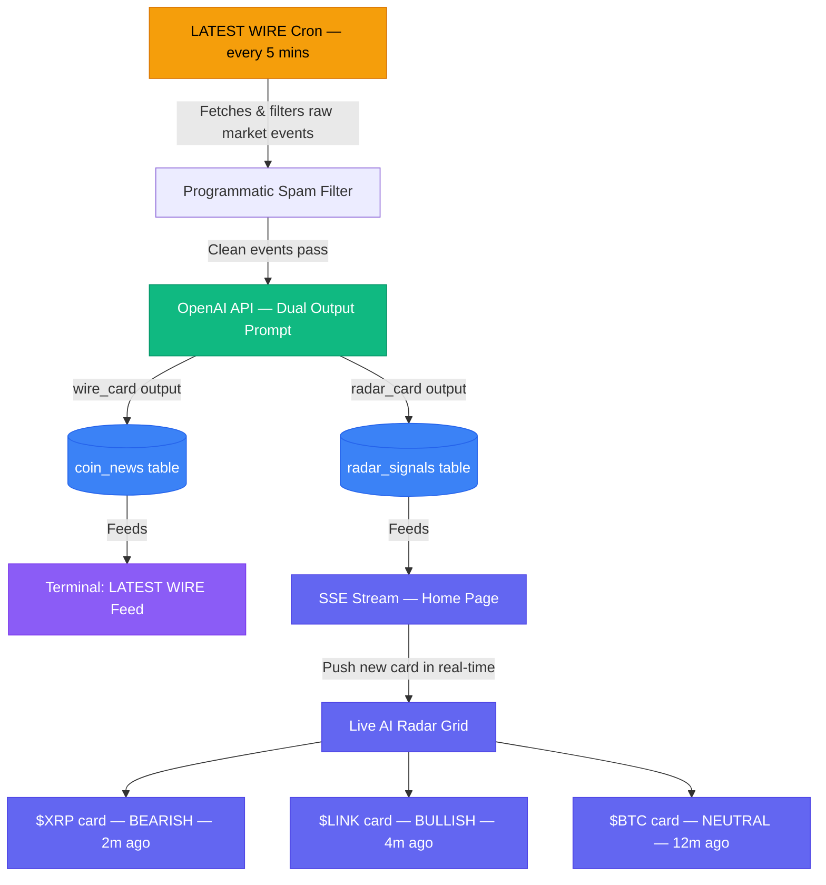

# 📡 Feature: Live AI Radar

## 📌 1. Overview
The **Live AI Radar** is the dynamic signal grid occupying the lower section of the Home page. It presents a continuously-updating stream of short, AI-distilled market signals across multiple assets — functioning like a **"Twitter feed for the AI analyst"**. Each card delivers a single, high-conviction insight in one or two sentences, tagged with a sentiment verdict and a recency timestamp.

### UI Elements (from `home.html`)
- **Asset Tag** → Colored badge per coin (e.g., `$LINK` in blue, `$BTC` in orange, `$UNI` in purple)
- **Status Dot** → Green (bullish), Yellow (neutral/volatile), Red (bearish)
- **Signal Headline** → 1-2 sentence AI-written insight (e.g., *"Smart money accumulation detected in range $14.20 - $14.50"*)
- **Sentiment Label** → `Bullish` / `Neutral` / `Bearish` / `Volatile`
- **Recency Timestamp** → `4m ago`, `12m ago`, `1h ago`
- **Grid Layout** → 3×2 card grid (6 signals visible at once)
- **Asset Count** → `Scanning 2,482 Assets` live counter

---

## ⚙️ 2. The Key Architecture Decision: Reusing LATEST WIRE

The Live AI Radar does **not** have its own independent data pipeline. This is by design. Instead, it is a **second consumer** of the data already being produced by the **LATEST WIRE** engine (built for the Terminal page).

This is the core integration logic: the same 5-minute cron job that populates the Terminal's news feed **simultaneously writes** condensed signal cards to the Radar feed on the Home page.

**Why this is smart:**
- Zero extra AI API cost — the analysis is already paid for.
- The Radar stays fresh on the same cycle as the news feed (every 5 minutes).
- One pipeline, two outputs: long-form news card for Terminal, short-form signal card for Home.

> **Cross-reference:** [LATEST WIRE Documentation](../termnal/the-posts.md)

---

## 🔀 3. The Signal Generation Flow (Event → Radar Card)

### Step 1: LATEST WIRE Catches the Event
The existing news scraper detects a high-signal event. Example:
> Raw data: *"A whale wallet transferred 120,000,000 XRP to a Binance hot wallet address at block #89,123,456."*

### Step 2: AI Dual-Output Prompt
When the LATEST WIRE sends this data to OpenAI for processing, the prompt is structured to produce **two outputs simultaneously**:

```text
You are OnlyAlpha's market intelligence engine.
Analyze the following raw market event and produce TWO outputs:

1. WIRE_CARD: A professional news headline (max 12 words) for the Terminal news feed.
2. RADAR_CARD: A single punchy insight sentence (max 15 words) for the Home Radar feed,
   plus a sentiment verdict (BULLISH | NEUTRAL | BEARISH | VOLATILE) and the primary coin ticker.

Raw Event: {{RAW_EVENT_TEXT}}
```

**Example AI Output:**
```json
{
  "wire_card": {
    "headline": "Large whale transfer of 120M XRP to exchange signals local top.",
    "tag": "$XRP"
  },
  "radar_card": {
    "coinSymbol": "XRP",
    "signal": "Large whale transfer to exchange wallet (120M) signals local top.",
    "verdict": "BEARISH",
    "colorClass": "red"
  }
}
```

### Step 3: Dual Write to Database
The pipeline writes both outputs simultaneously:
- `coin_news` table → feeds the **Terminal LATEST WIRE**
- `radar_signals` table → feeds the **Home Live AI Radar**

### Step 4: Real-time Push to UI
New radar signals are pushed to the frontend via **Server-Sent Events (SSE)**. The Home page holds an open SSE connection and inserts new cards at the top of the grid with a smooth slide-in animation as they arrive, without any page refresh.

---

## 🗄️ 4. Database Schema

```typescript
// Radar signals table — powers the Live AI Radar grid
export const radarSignals = pgTable('radar_signals', {
  id: serial('id').primaryKey(),
  coinSymbol: varchar('coin_symbol', { length: 20 }).notNull(),   // e.g., 'XRP'
  signal: text('signal').notNull(),                               // 1-sentence AI insight
  verdict: varchar('verdict', { length: 20 }).notNull(),          // 'BULLISH' | 'BEARISH' | 'NEUTRAL' | 'VOLATILE'
  colorClass: varchar('color_class', { length: 20 }).notNull(),   // 'green' | 'red' | 'yellow' | 'blue'
  sourceNewsId: integer('source_news_id')
    .references(() => coinNews.id),                               // FK back to the LATEST WIRE record
  impactScore: integer('impact_score').default(0),                // Inherited from LATEST WIRE scoring
  createdAt: timestamp('created_at').defaultNow().notNull(),
});
```

**Key design note:** `sourceNewsId` creates a foreign key link back to the `coin_news` table. This enables a future "Read Full Analysis →" button on each card that deep-links to the full Terminal report.

---

## 🔀 5. Full Data Flow Diagram



---

## 🛡️ 6. Display Rules & Edge Cases

* **Max Cards Visible:** The grid shows the **6 most recent** signals at any time (3×2 layout matching `home.html`). Older cards are archived in the DB but hidden from the grid.
* **Card Expiry:** Signals older than **6 hours** are automatically dimmed (`opacity-60`) and eventually removed from the live grid to prevent stale data confusing users.
* **Duplicate Suppression:** The same `coinSymbol` cannot appear twice in the visible 6-card grid simultaneously. If a second $BTC signal comes in, it **replaces** the existing one rather than adding a second card.
* **Impact Prioritization:** Signals with a high `impactScore` (inherited from LATEST WIRE scoring) are promoted to the top of the grid even if they are not the most recent, ensuring critical events never get buried.
* **Asset Counter:** The `Scanning 2,482 Assets` counter is not static — it reflects the actual count of distinct `coinSymbol` entries in the `market_insights` table, updated daily.
