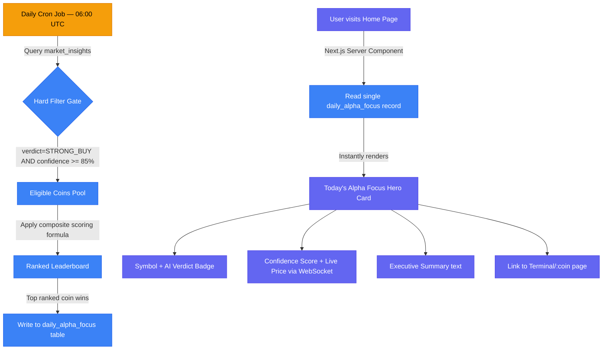

# 🎯 Feature: Today's Alpha Focus

## 📌 1. Overview
**Today's Alpha Focus** is the hero section of the Home page — the large, dominant card occupying the top 50% of the main content area. It showcases a **single, algorithmically-selected coin** as the platform's highest-conviction trade opportunity for the day.

Rather than presenting a static or manually curated pick, this section is **fully automated**: the system scans the `market_insights` database table every morning and surfaces the coin that meets the highest-confidence "STRONG BUY" criteria as the day's featured asset.

### UI Elements (from `home.html`)
- **Coin Symbol** → `$SOL` (large, uppercase, prominent)
- **AI Verdict Badge** → Blue pill: `AI VERDICT: STRONG BUY`
- **Confidence Score** → `92.4% Confidence` (displayed beside the badge)
- **Live Price** → `$145.20` with `+4.21% (24H)` change indicator
- **24H Chart** → A high-density SVG sparkline showing the execution path
- **Executive Summary** → A 2-3 sentence AI-written narrative explaining *why* this coin is the focus
- **CTA** → `EXPLORE FULL ON-CHAIN ANALYSIS →` Link to the Terminal page for this coin

---

## ⚙️ 2. The Selection Algorithm (How the "Hero" is Chosen)

The core question is: **out of all the coins analyzed daily, how does the system pick THE ONE?**

### The Logic: Automated Leaderboard Query

Every morning at a fixed time (e.g., `06:00 UTC`), a scheduled **Cron Job** runs a database query against the `market_insights` table. The query applies a strict, multi-factor scoring system:

#### Step 1: Hard Filter (Eligibility Gate)
Before scoring, the query filters out any coin that does NOT meet all of the following:
- `verdict = 'STRONG_BUY'` → Only coins with the highest AI conviction make it past this gate.
- `confidence_score >= 85.0` → Eliminates borderline signals. The hero must be a high-conviction pick.
- `analyzed_at >= NOW() - INTERVAL '24 hours'` → The analysis must be fresh. No stale picks.
- `is_published = true` → Only fully processed and reviewed insights are eligible.

#### Step 2: Composite Scoring (Ranking the Eligible Coins)
The coins that pass the gate are ranked by a **composite score** calculated from multiple weighted signals:

| Signal | Weight | Rationale |
|--------|--------|-----------|
| `confidence_score` | **40%** | The AI's primary conviction level |
| `volume_surge_pct` | **25%** | Unusual volume activity = smart money moving |
| `tvl_change_pct` (last 72h) | **20%** | TVL growth = fundamental demand |
| `social_momentum_score` | **15%** | Organic community interest (noise-filtered) |

#### Step 3: Winner Selection
The coin with the **highest composite score** is selected as the Alpha Focus for the day.
- Its full data (symbol, price, chart data, executive summary, confidence score) is written to a dedicated `daily_alpha_focus` record in the database.
- The Home page's Server Component reads **only from this single record** — making the page load instantaneous.

---

## 🗄️ 3. Database Schema

```typescript
// The main insights table (populated by the Terminal's AI pipeline)
export const marketInsights = pgTable('market_insights', {
  id: serial('id').primaryKey(),
  coinSymbol: varchar('coin_symbol', { length: 20 }).notNull(),   // e.g., 'SOL'
  verdict: varchar('verdict', { length: 30 }).notNull(),           // 'STRONG_BUY' | 'BUY' | 'NEUTRAL' | 'SELL'
  confidenceScore: real('confidence_score').notNull(),             // e.g., 92.4
  executiveSummary: text('executive_summary').notNull(),           // AI-written narrative
  volumeSurgePct: real('volume_surge_pct'),                        // % vs 7-day avg volume
  tvlChangePct: real('tvl_change_pct'),                            // TVL change over 72h
  socialMomentumScore: real('social_momentum_score'),              // 0-100 internal score
  isPublished: boolean('is_published').default(false),
  analyzedAt: timestamp('analyzed_at').notNull(),
});

// The single daily record that powers the Hero section
export const dailyAlphaFocus = pgTable('daily_alpha_focus', {
  id: serial('id').primaryKey(),
  insightId: integer('insight_id').references(() => marketInsights.id).notNull(),
  coinSymbol: varchar('coin_symbol', { length: 20 }).notNull(),
  compositeScore: real('composite_score').notNull(),               // Final ranked score
  selectedAt: timestamp('selected_at').defaultNow().notNull(),
  focusDate: date('focus_date').notNull().unique(),                // One pick per day
});
```

---

## 🔀 4. Data Flow



---

## 🛡️ 5. Edge Cases & Fail-Safes

* **No eligible coin today?:** If no coin passes the Hard Filter Gate (e.g., overall bearish market day), the system falls back to displaying the coin with the highest `confidence_score` regardless of verdict, adding a **`CAUTION`** label to the badge: `AI VERDICT: MONITOR CLOSELY`.
* **Staleness Guard:** If the `daily_alpha_focus` record for today is missing when a user visits (e.g., cron job failed), the Next.js page falls back to the **most recent valid** focus record, displaying a subtle `"Analysis from Xh ago"` timestamp label.
* **Price Override:** The price shown in the hero card is **always** sourced from a live WebSocket connection (not from the DB), ensuring the number is never stale even if the hero selection was made 8 hours ago.
