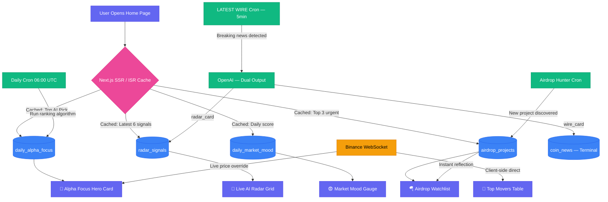

# 🏠 Home Dashboard — Master Engineering Architecture

## 📌 1. Overview
The **Home Dashboard** is not a data-analysis page — it is the platform's **Aggregation Hub**. Its sole purpose is to give the user an instant, bird's-eye view of the market the moment they log in, powered 100% by the pre-computed outputs of the Terminal and Airdrop engines running in the background.

> The Home page runs **no AI itself**. It is a lightweight consumer of results that were already computed and stored by other engines. This makes it extremely fast and cheap to serve.

## 🔗 2. Sub-Feature Documentation
The Home Dashboard is composed of three independently documented feature modules:
- [🎯 Today's Alpha Focus (Hero Section)](./TODAY'S-ALPHA-FOCUS.md)
- [📡 Live AI Radar (Signal Grid)](./LIVE-AI-RADAR.md)
- [📊 Global Market Widgets (Right Sidebar)](./Global-Market-Widgets.md)

---

## 🏗️ 3. UI Components → Backend Logic Mapping

| UI Section | Location | Powered By | Data Source | Update Cycle |
|---|---|---|---|---|
| **Ticker Bar** | Top header | Binance WebSocket | Live price stream | Real-time |
| **Today's Alpha Focus** | Left, top 50% | AI Ranking Algorithm | `market_insights` DB + Binance WS | Daily + Live price |
| **Live AI Radar** | Left, bottom 50% | LATEST WIRE Pipeline | `coin_news` → `radar_signals` DB | Every 5 minutes (SSE push) |
| **Market Mood Gauge** | Right column, top | Hybrid Sentiment Engine | Alternative.me API + Internal AI avg | Daily |
| **Top Movers Table** | Right column, mid | Binance API (direct) | 24H Ticker WebSocket | Real-time (client-side) |
| **Airdrop Watchlist** | Right column, bottom | Airdrop Hub Engine | `airdrop_projects` DB | Event-driven (on AI discovery) |

---

## ⚙️ 4. Core Feature Logic

### 🌟 4.1 Today's Alpha Focus
The dominant hero card. The system's **highest-confidence trade signal of the day**, selected automatically each morning via a multi-factor ranking algorithm — no human curation involved.

**Selection Logic (Simplified):**
1. Hard filter: `verdict = 'STRONG_BUY'` AND `confidence_score >= 85%` AND `analyzed_at < 24h ago`
2. Composite score: `(Confidence × 40%) + (Volume Surge × 25%) + (TVL Change × 20%) + (Social Momentum × 15%)`
3. The top-ranked coin is written to `daily_alpha_focus` table
4. Next.js Server Component reads from this single record at page load time → zero computation on request

**Fail-safes include:**
- Fallback to "MONITOR CLOSELY" badge if no coin passes the hard filter
- Live WebSocket price always overrides the cached static price from the DB
- Graceful degradation to last valid record if cron job fails

> **Full details:** [TODAY'S-ALPHA-FOCUS.md](./TODAY'S-ALPHA-FOCUS.md)

---

### 📡 4.2 Live AI Radar
A real-time signal grid functioning as **"Twitter for the AI analyst"** — one punchy insight per card, sentiment-tagged, with a live timestamp.

**Key Architecture Decision:**
The Radar does **not** have its own AI pipeline. It is a **second consumer** of the LATEST WIRE engine (built for the Terminal). The same 5-minute cron job produces two outputs per event via a single OpenAI call:
- `wire_card` → long-form news for the Terminal
- `radar_card` → single-sentence signal for the Home Radar

**Display rules:**
- Grid shows 6 most recent signals (3×2)
- Signals older than 6 hours are dimmed then removed
- Same coin cannot appear twice; a newer signal replaces the older one
- High `impactScore` signals are promoted above recency order

> **Full details:** [LIVE-AI-RADAR.md](./LIVE-AI-RADAR.md)

---

### 📊 4.3 Global Market Widgets (Right Sidebar)

**Market Mood (Fear & Greed Gauge):**
Uses a **Hybrid Model** — External API provides the macro baseline (Alternative.me), while our internal AI sentiment data (from `coin_news` and `radar_signals`) provides a proprietary correction layer:
- `Final Score = (Alternative.me × 60%) + (Internal AI Sentiment × 40%)`
- Written once daily to `daily_market_mood` table

**Top Movers:**
Pure client-side. A Binance WebSocket stream feeds the top 100 coins. A sort runs every 30 seconds client-side to extract the top 3 gainers. Zero server involvement.

**Airdrop Watchlist:**
Reads directly from the `airdrop_projects` table (written by the AI Airdrop Hunter). Zero additional pipeline needed. Personalized to show only projects the logged-in user is actively farming (at least 1 auto-verified task).

> **Full details:** [Global-Market-Widgets.md](./Global-Market-Widgets.md)

---

## 🗄️ 5. Caching & Data Fetching Strategy
Because the Home page is the most-visited page in the platform, load time must be near-zero:

| Data Type | Sections | Strategy | Revalidation |
|---|---|---|---|
| **Static / Cached** | Alpha Focus, Airdrop Watchlist, Market Mood | Next.js ISR + DB read | Every 10 minutes |
| **Live / Streaming** | Live AI Radar, Top Movers, Hero price ticker | SSE + WebSocket | Real-time |

**The Principle:** The page opens instantly from cache. Live data streams in within 1 second after paint.

---

## 🔀 6. Full Home Dashboard Data Flow



---

## 📐 7. Cross-Feature Integration Map
The Home page is a **read-only consumer** of results from all other system engines:

```
Terminal Engine ──► coin_news ──────────────────────────► Live AI Radar
                 └─► market_insights ──► daily_alpha_focus ─► Alpha Focus Hero

Airdrop Engine ──► airdrop_projects ─────────────────────► Airdrop Watchlist

External APIs ──► Alternative.me ──► daily_market_mood ──► Market Mood Gauge
              └─► Binance WS ─────────────────────────────► Top Movers + Live Price
```

> 💡 **The Bottom Line:**  
> The Home page has **zero AI compute cost per page load**. Every number, verdict, and signal it displays was already computed by another engine and stored in the database. The Home page simply reads, formats, and presents — making it the fastest and most scalable page in the entire platform.
