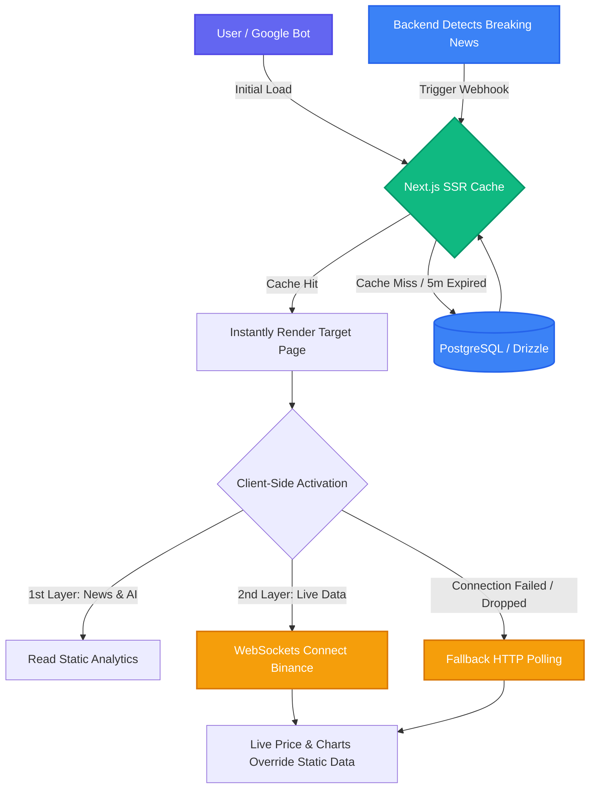

# 📊 Terminal Engineering Architecture

The architecture of the **Terminal** page is built on the critical triangle of **(Performance - SEO - Freshness)**. 

This document serves as the master guide for the Terminal feature, establishing the structural integration between all its components.

## 🔗 Sub-Features Documentation
The Terminal is composed of several intelligent sub-systems. Please refer to their specific detailed documentations:
- [📰 LATEST WIRE (AI-Curated News Feed)](./the-posts.md)
- [🤖 AI Chatbot (Ask OnlyAlpha)](./chat-bot.md)

---

## 🏗️ 1. Hybrid Data & Caching Strategy
Because the Terminal combines "instant/live" data with "analytical" data, a hybrid data flow system is required.

* **Analytical Data (AI Verdicts & Insights):**
  * **Logic:** Fetched from our custom database (PostgreSQL/Drizzle).
  * **Caching:** Implemented using Next.js ISR (Incremental Static Regeneration) or client-side SWR/React Query with a 5-minute Revalidation time limit. This guarantees lightning-fast loading times as the UI uses cached data, while background processes silently fetch fresh insights.
* **Real-time Data (Live Prices & Tickers):**
  * **Logic:** Bypasses our immediate backend and database entirely.
  * **Connection:** Direct WebSocket connection from the client browser directly to the exchange API (e.g., Binance API). This keeps charts and tickers actively moving live without bottlenecking our server's resources.

## �️ 2. Edge-Case Mitigation & System Stability
To ensure a bulletproof user experience, three critical fail-safes and logic patches have been integrated:

* **Handling Hydration Conflicts (Price Staleness):**
  * **The Gap:** SSR provides analytical data (which includes a slightly delayed static price token), while WebSockets stream live prices. This can cause a visual flicker or "Hydration mismatch" upon initial load.
  * **The Solution:** The logic implements a targeted **Override mechanism**. When the page loads, it briefly displays the SSR price. The exact moment the WebSocket connects, the incoming live stream safely overwrites the static DOM price seamlessly, avoiding any visual glitch or dual-price display.

* **On-demand Revalidation (Handling Breaking News):**
  * **The Gap:** Standard ISR revalidates every 5 minutes. If a "bomb" breaking news event occurs within that window, the AI analysis becomes instantly outdated.
  * **The Solution:** **Webhook Triggers**. When the backend detects critical breaking news or finishes a high-priority AI analysis cycle, it fires a webhook to Next.js (`revalidatePath`). This instantly purges the cache for that specific token (`/terminal/solana`) and updates the frontend for all incoming users without waiting for the 5-minute timer.

* **Fail-safe Mechanism (Connection Drops):**
  * **The Gap:** If the user’s internet fluctuates or the Binance API rate limits the connection, the WebSocket will drop, freezing the chart unprofessionally.
  * **The Solution:** **Polling Fallback**. A heartbeat listener monitors the WebSocket. If no data is received for 10 seconds, the system automatically falls back to standard HTTP Polling (fetching data via REST API every 5 seconds). This second line of defense ensures the page remains "alive" until the WebSocket can safely reconnect.

## �🔍 3. SEO & Indexing Strategy
Crypto data is highly volatile, meaning the page content changes continuously. Getting Google to index this properly requires a specific approach.

* **SSR (Server-Side Rendering):**
  * By utilizing Next.js Server Components, the page is pre-rendered on the server side. When search engine bots crawl the Terminal, they are presented with a fully-readable HTML page loaded with headlines, news, and analysis, instead of an empty skeleton waiting for JavaScript fetches.
* **Dynamic Metadata:**
  * Every coin page needs customized, dynamic Meta Titles and Descriptions.
  * *Example:* `<title>Solana (SOL) Live Analysis & AI Verdict - OnlyAlpha</title>`
* **JSON-LD (Schema Markup):**
  * We inject invisible JSON-LD scripts indicating to Google that this is a "Financial Analysis" or "NewsArticle". This structured data acts as an SEO hack to obtain Google Search "Rich Snippets."

## 🗺️ 4. URL Structure & Sitemaps
* **Dynamic Sitemap:** An automated generation script that updates the `sitemap.xml` continuously to include links for all newly analyzed tokens.
* **Clean Slug System:** URLs are designed to be extremely clean and human-readable.
  * *URL Pattern:* `onlyalphacrypto.com/terminal/solana`

## ⚙️ 5. The Full Integration Flow Matrix
| Layer | Function | Technology Stack |
|-------|----------|------------------|
| **Data Fetching** | Pulling analyzed DB reports & insights | Drizzle ORM + Next.js Server Actions |
| **Real-time Flow** | Continuously updating prices & charts | Client-side WebSockets (Binance API) |
| **Caching** | Freezing requests to prevent server strain | Next.js Data Cache + React Query |
| **SEO** | Indexing the platform in search engines| SSR + Dynamic Meta Tags + JSON-LD |

---

## 🔀 6. Data Flow Visualization

---

> 💡 **The Bottom Line (User & Bot Flow):**
> 1. **Google Crawler** enters -> Instantly reads the cached "Written AI Analysis" -> Boosts SEO.
> 2. **Human User** enters -> Instantly reads the cached "Written AI Analysis" (Zero load time latency).
> 3. After exactly 1 second, the **WebSockets** kick in, bringing the financial charts dynamically to life in real-time.
