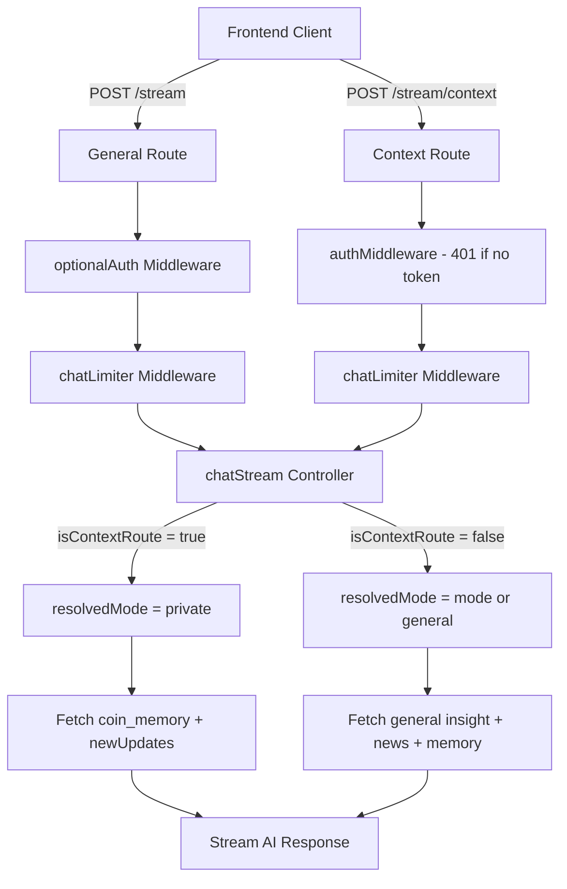

# Task 3B: Context AI Mode — coin_memory + requireAuth

## Overview
This task has two parts:
1. Integrate `coin_memory` data into the Context (private) mode response in `chat.controller.ts`
2. Split the chat routes so Context mode requires authentication while General mode remains optional

---

## Part 1: Add coin_memory to Context Mode

**File:** [`chat.controller.ts`](backend/src/controllers/chat.controller.ts)

**Location:** Inside the `if (mode === 'private' && articleId && articleType)` block (lines 32-71), specifically between the `newUpdates` block (lines 64-68) and the `INSTRUCTION:` line (line 71).

**Current code (lines 64-71):**
```typescript
if (newUpdates.length > 0) {
    contextText += `\n[LATEST UPDATES SINCE ARTICLE]: ${newUpdates.map(n => n.headline).join(' | ')}`;
} else {
    contextText += `\n[LATEST UPDATES]: No newer updates found since this article was published.`;
}

contextText += `\nINSTRUCTION: The user is asking about the PRIMARY FOCUS article. Analyze it and consider any LATEST UPDATES. Be concise.`;
```

**New code to insert (between line 68 and line 71):**
```typescript
const memory = await db.select({ eventSummary: coinMemory.eventSummary, eventType: coinMemory.eventType, riskVerdict: coinMemory.riskVerdict })
    .from(coinMemory)
    .where(eq(coinMemory.coinSymbol, symbol))
    .orderBy(desc(coinMemory.createdAt))
    .limit(5);
if (memory.length > 0) {
    const memoryStr = memory.map(m => `[${m.eventType}] ${m.eventSummary} (Risk: ${m.riskVerdict || 'N/A'})`).join('\n');
    contextText += `\n[COIN MEMORY - Historical Events]:\n${memoryStr}`;
}
```

**Result:** The `INSTRUCTION:` line will now come after the coin memory data, so the full contextText will contain: PRIMARY FOCUS → LATEST UPDATES → COIN MEMORY → INSTRUCTION.

---

## Part 2a: Split Chat Routes

**File:** [`chat.routes.ts`](backend/src/routes/chat.routes.ts)

**Current code:**
```typescript
import { Router } from 'express';
import { chatStream } from '../controllers/chat.controller';
import { optionalAuth } from '../middleware/auth.middleware';
import { chatLimiter } from '../middleware/rateLimit.middleware';

const router = Router();

router.post('/stream', optionalAuth, chatLimiter, chatStream);

export default router;
```

**New code:**
```typescript
import { Router } from 'express';
import { chatStream } from '../controllers/chat.controller';
import { optionalAuth, authMiddleware } from '../middleware/auth.middleware';
import { chatLimiter } from '../middleware/rateLimit.middleware';

const router = Router();

router.post('/stream', optionalAuth, chatLimiter, chatStream);
router.post('/stream/context', authMiddleware, chatLimiter, chatStream);

export default router;
```

**Behavior:**
- `POST /stream` — optionalAuth (guests can use, limited by guest middleware in 3C)
- `POST /stream/context` — authMiddleware (login required, 401 if no token)

---

## Part 2b: Detect Context Route in Controller

**File:** [`chat.controller.ts`](backend/src/controllers/chat.controller.ts)

**Change 1:** Add route detection at the top of `chatStream`, after the destructuring of `req.body`:

```typescript
const isContextRoute = req.path === '/context';
```

**Change 2:** Add resolvedMode after the existing mode extraction:

```typescript
const resolvedMode = isContextRoute ? 'private' : (mode || 'general');
```

**Change 3:** Replace all `mode` references in the controller logic with `resolvedMode`:

| Line | Current | New |
|------|---------|-----|
| 32 | `if (mode === 'private' && articleId && articleType)` | `if (resolvedMode === 'private' && articleId && articleType)` |
| 95 | `const chatMode = mode === 'private' ? 'context' : 'general';` | `const chatMode = resolvedMode === 'private' ? 'context' : 'general';` |

**Note:** The `mode` variable from `req.body` destructuring (line 15) stays as-is since it's the raw input. Only the logic references change to `resolvedMode`.

---

## Architecture Diagram



---

## Backward Compatibility

- Existing frontend calling `POST /stream` without a `mode` field will still work — it resolves to `general` mode
- The `mode` field in `req.body` is still accepted and used when not on the `/context` route
- No changes to response format or SSE streaming behavior
